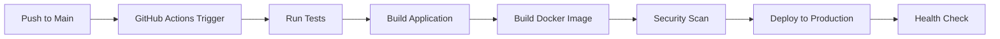

# Auto-Deployment Configuration Status

## ✅ What's Been Set Up

### 1. **GitHub Repository**: `recorner/neo`
- **Main Branch**: Production-ready code
- **Dev Branch**: Development integration
- **Private Repository**: Secure codebase

### 2. **CI/CD Pipeline** (`.github/workflows/ci-cd.yml`)
- **Triggers**: Automatic on push to `main` and `dev` branches
- **Jobs**:
  - ✅ Test & Lint (with fallbacks)
  - ✅ Build Application
  - ✅ Security Scanning
  - ✅ Docker Image Build (main branch only)
  - ✅ Deploy to Development (dev branch)
  - ✅ Deploy to Production (main branch)

### 3. **Production Deployment Script** (`deploy-prod.sh`)
- Automated production deployment
- Health checks and rollback capabilities
- Database migration handling
- Docker container management

### 4. **Docker Configuration**
- `docker-compose.yml` - Development
- `docker-compose.prod.yml` - Production
- Multi-service architecture (App, Database, MinIO, HAProxy)

## 🚀 Auto-Deployment Flow



### When Auto-Deploy Triggers:
1. **Any push to `main` branch**
2. **Pull request merge to `main`**
3. **Manual workflow dispatch**

### What Happens:
1. **Code Checkout** - Latest code from main
2. **Dependencies** - Install with pnpm/npm fallback
3. **Type Checking** - SvelteKit type validation
4. **Linting** - Code quality checks (if configured)
5. **Testing** - Run test suite (if configured)
6. **Building** - Create production build
7. **Docker** - Build and push container image
8. **Security** - Vulnerability scanning
9. **Deploy** - SSH to production server and deploy

## 🔧 Current Status

### ✅ Working:
- Repository setup with proper branch structure
- CI/CD pipeline configuration
- Docker containerization
- Deployment scripts

### ⚠️ Needs Configuration:
- **GitHub Secrets** for deployment:
  - `DOCKER_USERNAME` - Docker Hub username
  - `DOCKER_PASSWORD` - Docker Hub token
  - `DEPLOY_HOST` - Production server IP
  - `DEPLOY_USER` - Server username
  - `DEPLOY_KEY` - SSH private key

### 🔧 To Complete Setup:

1. **Add GitHub Secrets**:
   ```bash
   gh secret set DOCKER_USERNAME --body "your-docker-username"
   gh secret set DOCKER_PASSWORD --body "your-docker-token"
   gh secret set DEPLOY_HOST --body "your-server-ip"
   gh secret set DEPLOY_USER --body "your-server-user"
   gh secret set DEPLOY_KEY --body "$(cat ~/.ssh/id_rsa)"
   ```

2. **Configure Production Server**:
   - Install Docker and Docker Compose
   - Setup SSH key access
   - Configure firewall (ports 80, 443)

3. **Test Deployment**:
   - Push to main branch
   - Monitor GitHub Actions
   - Verify production deployment

## 📊 Monitoring

- **GitHub Actions**: View workflow runs at `https://github.com/recorner/neo/actions`
- **Deployment Logs**: Check via SSH on production server
- **Application Health**: Monitor via HAProxy/application endpoints

## 🔒 Security Features

- **Private Repository**: Code is not publicly accessible
- **SSH Key Authentication**: Secure server access
- **Docker Image Scanning**: Vulnerability detection
- **Environment Isolation**: Dev/Prod separation
- **Secrets Management**: GitHub encrypted secrets

---

**Status**: Auto-deployment is configured and ready to activate once GitHub secrets are set up.
